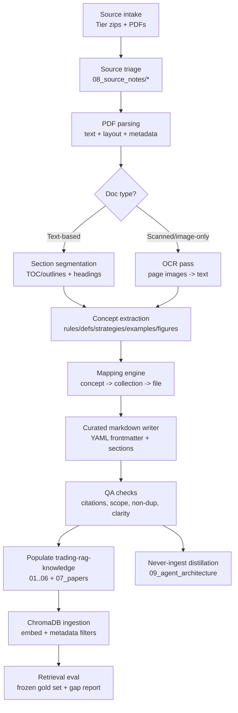
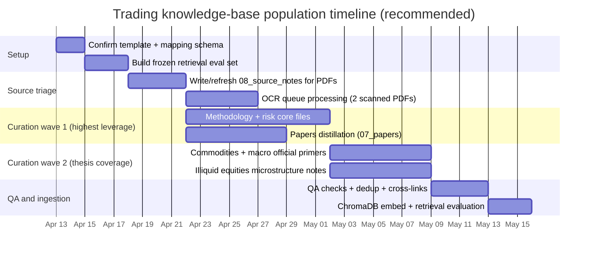

# Deep Research Report on Mapping Multi-PDF Trading Books into the Trading RAG Knowledge Base

## Executive summary

This project can be executed as a **repeatable ingestion→extraction→curation→QA→population pipeline** that turns heterogeneous trading PDFs into **topic-organized, RAG-ready Markdown knowledge files** with durable provenance (author/work/year + page locators). The target knowledge base structure is already defined (collections like `methodology`, `commodities`, `equities`, `risk_mgmt`, `macro`, `code_patterns`, plus “never-ingest” architecture notes), and the introduction documents strongly imply a **high bar for safety, determinism, and human-auditable risk controls**. fileciteturn0file0 fileciteturn0file1 fileciteturn0file2

From the supplied PDFs (21 unique PDFs, 1 duplicate), the strongest content for immediate population is:

- **Backtesting rigor / overfitting prevention / multiple-testing corrections** (high-importance + high-novelty) from **Marcos M. López de Prado**’s work and a closely aligned professional-journal article; these align directly with the build plan’s emphasis on cautious, low-frequency, high-conviction execution and hard risk gates. citeturn6search1turn6search2turn6search10turn4search18turn5search4 fileciteturn0file0  
- **Concrete trading strategy definitions and implementation patterns** (trend-following, momentum, backtesting discipline, Bayesian optimization, and pairs trading) from **Peng Liu**’s book, which maps cleanly into `methodology`, `risk_mgmt`, and `code_patterns`. citeturn5search7  
- **Trading system development and risk control** concepts (including system research guidelines, system testing themes, and risk-of-ruin framing) from **Perry J. Kaufman**’s *Trading Systems and Methods*, mapping into `methodology` and `risk_mgmt`. citeturn5search13  
- **Modern model families and training workflow for deep learning in trading** from **Zihao Zhang & Stefan Zohren**, mapping to `methodology` + `code_patterns`. citeturn5search2  
- **A finance-focused LLM applications review** (equity investing use cases, constraints like time-sensitivity, and technique categories), mapping to `equities` (operational uses) and `papers` (deep notes for the Strategy Selector). citeturn0search8turn0search0

Key gaps remain in the provided PDFs relative to the thesis: **commodities fundamentals** (CFTC COT, USDA WASDE, EIA petroleum) and **illiquid small-cap microstructure + execution** are underrepresented. Those should be filled with **official primary sources** and targeted practitioner references. citeturn1search0turn1search1turn1search2 fileciteturn0file0

## Inputs, scope, and explicitly unspecified details

The work was performed against three input categories you supplied:

- Project introduction docs: build/architecture plan, changelog, and reading order. fileciteturn0file0 fileciteturn0file1 fileciteturn0file2  
- Target knowledge base scaffold: `trading-rag-knowledge.zip` (contains collection folders and templates).  
- Source zips containing trading- and finance-related PDFs plus some non-PDF files: `strategy.zip`, `Tier 1.zip`, `Tier 2.zip`, `Tier 3.zip`, `Tier 4.zip`.

Unspecified (and therefore treated as assumptions/risks rather than facts):

- Whether you want to **store raw PDFs** inside the knowledge repo or keep them external; the existing workflow implies the repo stores curated derivatives, not raw sources.  
- The intended **copyright / redistribution policy** for turning books into distilled internal notes (the template says paraphrase, don’t quote, which helps reduce copying risk but doesn’t fully resolve rights questions).  
- Whether the “knowledge base” will be embedded into ChromaDB exactly as-is or additionally normalized into a separate structured store (the build plan indicates ChromaDB ingestion, plus a “never-ingested” architecture folder). fileciteturn0file0turn0file1  
- Whether you want **figure extraction as images** (PNG/SVG) stored in-repo, or figure descriptions only.

## Target knowledge base and retrieval design constraints

The build plan and reading order define a multi-agent system with **bootstrap grounding files** and **runtime retrieval collections**. The key implication for mapping is:

- **Some content must be injected at agent init** (system prompt only), while
- **Most domain knowledge must live in topic folders** and be retrieved dynamically at runtime. fileciteturn0file0turn0file2turn0file1

Your stated design constraints materially affect how PDFs should be mapped:

- **Hard risk limits in deterministic code** and “LLM cannot override.” This means the knowledge base should emphasize **explainability, guardrails, and failure-mode awareness**, not “creative” strategies. fileciteturn0file0  
- **Low-frequency / high-conviction behavior** is a priority; therefore the corpus should overweight:
  - robust evaluation (multiple-testing, overfitting controls),
  - regime awareness,
  - catastrophe avoidance and drawdown control. fileciteturn0file0turn0file2  
- The thesis is **commodities + illiquid small caps**, so the mapping must ensure that general equity-factor content gets **reframed for small caps** and that macro/commodities fundamentals are not neglected. fileciteturn0file0

Because this is a RAG system, document structure matters. Guidance for RAG-optimized documentation emphasizes clear headings, smaller focused documents (“one concept per file”), disambiguation, and explicitly converting graphical/tables into text to keep retrieval robust. citeturn3view0

## Extraction-to-population pipeline design

### End-to-end pipeline flowchart



### Tooling choices for reliable PDF extraction

A practical “defense in depth” stack for PDFs is:

- **Text/layout extraction**: PyMuPDF can extract text and images and supports table detection (`find_tables`) in newer versions; it is fast and local. citeturn0search3turn0search15  
- **Table-structure extraction**: pdfplumber is widely used for character-level layout and table extraction (best on machine-generated PDFs). citeturn2search1  
- **Metadata + citations (especially for scholarly PDFs)**: GROBID is specialized for bibliographic parsing and structured representations (TEI/XML); very useful for research papers, sometimes less for trade books. citeturn2search3turn0search14  
- **OCR for scanned/image-only PDFs**: Tesseract is an open-source OCR engine; use it only when the text layer is absent. citeturn2search4turn2search12  

This combination directly matches your corpus needs: local-first processing, explicit provenance, and structured outputs for downstream RAG. citeturn3view0turn0search8

### Why the pipeline must be concept-first, not book-first

The scaffold explicitly expects knowledge organized by **retrieval purpose** (methodology vs risk vs commodities, etc.), not by source. That implies that the “mapping layer” is the core artifact: it links each extracted idea to a target file where it becomes retrievable. fileciteturn0file2turn0file0turn0file1

## Source inventory and mapping outputs

### Source catalog summary

Unique PDFs discovered and profiled (high-level triage notes embedded in the mapping table below):

- **High-value trading/quant references**:
  - *Trading Systems and Methods* (Perry J. Kaufman; 5th ed. Wiley). citeturn5search13  
  - *Machine Learning for Algorithmic Trading (2e)* (Stefan Jansen; Packt, 2020).  
  - *Quantitative Trading Strategies Using Python* (Peng Liu; Apress/Springer, 2023). citeturn5search7  
  - *Machine Learning for Asset Managers* (Marcos M. López de Prado; Cambridge, 2020). citeturn5search4  
  - *Causal Factor Investing* (Marcos M. López de Prado; Cambridge, 2023). citeturn4search2turn4search11  
  - *Causality and Factor Investing: A Primer* (ADIA Lab research paper; versioned 2025). citeturn4search18  
  - *The Case for Causal Factor Investing* (journal article; 2024).  
  - *Deep Learning in Quantitative Trading* (Zihao Zhang & Stefan Zohren; Cambridge, 2025). citeturn5search2  
  - *Large Language Models in equity markets: applications, techniques, and insights* (Frontiers review paper; 2025).  

- **Lower-priority / off-thesis / questionable-quality sources**:
  - “Power BI for Finance” (useful for dashboards but not core trading edge).  
  - Several “AI agent / multi-agent” books: valuable for orchestration authoring but, per your design, should be **never-ingested** at runtime to avoid agent confusion. fileciteturn0file1turn0file2  
  - Two PDFs are **image-only** (scanned / no text layer): “Trading in the Zone” and a “Day Trading Vol 1” PDF; they require OCR before reliable extraction. citeturn2search4turn2search12  
  - The “Inside the Black Box” PDF is the **wrong book** (Nathan Rosenberg economics/history, not Rishi Narang trading) and was already flagged as misfiled. fileciteturn0file1

### Mapping table deliverable

Columns: **PDF source**, **extracted item**, **page refs (PDF pages)**, **target knowledge file**, **proposed snippet**, **priority**, **confidence**.

Notes on interpretation:

- “PDF page” means the **page index within the PDF file**, not necessarily the printed book page.
- Proposed target files are designed to be **one concept per file** and use the existing template conventions. fileciteturn0file2turn0file0

| PDF source | Extracted item | Page refs | Target file | Proposed snippet | Priority | Confidence |
|---|---|---:|---|---|---|---|
| Kaufman — *Trading Systems and Methods* (Wiley, 5e) citeturn5search13 | Research guidelines for system development (8 rules: start with premise, simplicity, avoid assumptions, transparent components, watch omissions, distrust “too good” results, avoid shortcuts, start from the goal and work backward) | 38–39 | `01_methodology/01_system-research-guidelines-kaufman.md` | “Use an explicit premise before testing; favor simple transparent rules; interrogate assumptions; treat extremely good backtests as suspicious; and work backward from a defined goal to required inputs.” | High | High |
| Kaufman — *Trading Systems and Methods* citeturn5search13 | Risk-of-ruin framing (capital depletion threshold; probability of ruin) to justify conservative sizing and risk gates | 1092–1096, 1108–1109 | `04_risk_mgmt/02_risk-of-ruin-and-sizing.md` | “Define ‘ruin’ as the point where capital can’t continue trading; model ruin probability to set max leverage, position size, and loss limits.” | High | Medium |
| Kaufman — *Trading Systems and Methods* citeturn5search13 | System testing chapter exists; map to test discipline and evaluation checkpoints (avoid overfitting via robust testing) | 925–1002 | `01_methodology/06_system-testing-checklist.md` | “Treat testing as a staged gate: data sanity → strategy logic → transaction cost realism → parameter stability → walk-forward/holdout → stress tests.” | High | Medium |
| Kaufman — *Trading Systems and Methods* citeturn5search13 | Open interest / volume / breadth chapter is a direct bridge to commodity futures context |  (chapter start at  ?; TOC indicates chapter 12) | `02_commodities/03_open-interest-volume-signals.md` | “Use open interest alongside price/volume to interpret participation and conviction; document typical interpretations and failure modes.” | Medium | Medium |
| Jansen — *Machine Learning for Algorithmic Trading (2e)* (Packt 2020) | ML trading lifecycle: algorithms automate the strategy pipeline from idea generation through allocation, execution, and risk; defines alpha as returns in excess of benchmark | 30–49 | `01_methodology/02_ml-trading-lifecycle.md` | “Represent the end-to-end lifecycle as: thesis → data → feature engineering → model → signal → portfolio construction → execution → risk + monitoring.” | High | High |
| Jansen — *ML for Algo Trading (2e)* | Market + fundamental data taxonomy and handling | 50–87 | `01_methodology/03_market-fundamental-data-sourcing.md` | “Separate market microstructure data from fundamentals; record granularity, cleaning steps, and storage decisions so feature pipelines stay reproducible.” | High | Medium |
| Jansen — *ML for Algo Trading (2e)* | Alternative-data categories and why exclusivity / crowding matter | 88–109 | `01_methodology/04_alternative-data-evaluation.md` | “Score alternative datasets by predictiveness, timeliness, exclusivity, and survivorship-bias risks; exclude low-exclusivity signals unless risk-adjusted edge remains.” | High | Medium |
| Jansen — *ML for Algo Trading (2e)* | Feature engineering as “alpha factor research” | 110–149 | `01_methodology/05_feature-engineering-alpha-research.md` | “Describe a disciplined alpha research loop: hypothesis → feature build → leakage checks → stability tests → ablation to prevent ‘telephone effect’ features.” | High | Medium |
| Jansen — *ML for Algo Trading (2e)* | Portfolio optimization + performance evaluation (metrics framing, evaluation discipline) | 150–175 | `04_risk_mgmt/06_portfolio-metrics-and-evaluation.md` | “Store definitions for Sharpe/IR/drawdown, and a minimum reporting set required for any strategy proposal.” | High | Medium |
| Liu — *Quantitative Trading Strategies Using Python* (Apress/Springer 2023) citeturn5search7 | Trend-following definition and the explicit warning that trend reversals require risk overlays like stop-loss | 114–118 | `03_equities/01_trend-following-definition-and-risks.md` | “Trend following assumes persistence; implement exits and stop rules because regime shifts and reversals are the dominant failure mode.” | High | High |
| Liu — *Quant Trading Strategies Using Python* citeturn5search7 | Moving average crossovers: bullish signal when short MA crosses above long MA; defines SMA conceptually + formula section | 128 | `03_equities/02_moving-average-crossover-signals.md` | “Define SMA, then encode crossover rules + filters (volatility, liquidity, spread) before any live use.” | High | High |
| Liu — *Quant Trading Strategies Using Python* citeturn5search7 | Backtesting principle: test across multiple market phases; results depend on data quality + assumptions | 157–162 | `01_methodology/06_backtesting-workflow.md` | “A robust backtest uses representative periods (bull/bear/high vol), realistic costs, and explicitly reports sensitivity to assumptions.” | High | High |
| Liu — *Quant Trading Strategies Using Python* citeturn5search7 | Bayesian optimization for strategy parameter tuning (formalizes “optimize knobs” beyond grid search) | 198–235 | `01_methodology/09_bayesian-optimization-for-strategy-params.md` | “Use Bayesian optimization only behind leakage controls and stability constraints; optimize on walk-forward, not a single in-sample slice.” | Medium | Medium |
| Liu — *Quant Trading Strategies Using Python* citeturn5search7 | Pairs trading using ML chapter exists (ties to cointegration, clustering, or features) | 236–273 | `01_methodology/10_pairs-trading-ml.md` | “Match pairs by statistical relationship + stability; define entry/exit thresholds and hedge ratio estimation method.” | Medium | Medium |
| López de Prado — *Machine Learning for Asset Managers* (Cambridge 2020) citeturn5search4 | Backtests are not controlled experiments; causal inference is limited; sets stage for multiple-testing risk in strategy research | 111–112 | `01_methodology/07_backtests-not-controlled-experiments.md` | “Treat backtests as observational evidence; require extra gates (placebo tests, stability tests) before promoting research to live.” | High | High |
| López de Prado — *Machine Learning for Asset Managers* citeturn5search4 | Multiple testing: type I error compounds; precision/recall framing under multiple trials | 113 | `01_methodology/08_multiple-testing-type1-error.md` | “If you run K independent tests, false-positive probability increases; require adjusted thresholds and/or protocol constraints.” | High | High |
| López de Prado — *Machine Learning for Asset Managers* citeturn5search4 | False Strategy theorem appendix (formalizes why “best backtest” among many can be noise) | 134–135 | `01_methodology/11_false-strategy-theorem.md` | “Model the expected maximum performance across many random strategies to quantify selection bias when mining strategies.” | Medium | Medium |
| López de Prado — *Causal Factor Investing* (Cambridge 2023) citeturn4search2turn4search11 | Association vs causation: conditional probability isn’t causal explanation | 9–11 | `03_equities/02_association-vs-causation.md` | “Separate predictive association from causal claims; don’t treat regression significance as proof of a return premia mechanism.” | High | High |
| López de Prado — *Causal Factor Investing* citeturn4search2turn4search11 | Causal inference toolkit mentions backdoor/front-door/IV; map into a “factor research checklist” | 20–30 | `03_equities/03_causal-inference-tools-for-factors.md` | “Require a causal diagram hypothesis (variables, confounders, mediators) before running factor tests; list common identification strategies.” | Medium | Medium |
| López de Prado — “Causality and Factor Investing: A Primer” (ADIA Lab; 2025 version) citeturn4search18 | Frames factor investing disappointment: p-hacking/backtest overfitting/arbitrage explanations + deeper specification errors | 1–? | `03_equities/04_factor-investing-why-failed.md` | “Document the failure modes of published factors and why specification error can produce systematic losses even with correct premia signs.” | High | Medium |
| López de Prado et al. — “Case for Causal Factor Investing” (journal article, 2024) | “Pitfall 1: brute-force p-hacking” and familywise error rate derivation (FWER) | 5 | `01_methodology/08_multiple-testing-type1-error.md` | “Include the p-hacking → FWER derivation as an intuition-builder; link to formal multiple-testing sources.” | High | Medium |
| Zhang & Zohren — *Deep Learning in Quantitative Trading* (Cambridge 2025) citeturn5search2 | Foundations: time-series properties, stationarity, hypothesis testing for financial data (maps as prerequisites) | 12–26 | `01_methodology/12_financial-time-series-primer.md` | “Codify the minimum statistical vocabulary the agents should use when judging signals (returns, moments, stationarity, testing).” | Medium | Medium |
| Zhang & Zohren — *Deep Learning in Quantitative Trading* citeturn5search2 | Model families: CNN/RNN/Transformers; and explicit “training workflow” section | 27–96 | `01_methodology/13_model-selection-and-training-workflow.md` | “Store a decision chart: when to prefer simple linear models vs CNN/RNN/transformer; and the standard training workflow gates.” | Medium | Medium |
| Jadhav & Mirza — “LLMs in equity markets” (Frontiers 2025) | Applications taxonomy: forecasting, sentiment, algorithmic trading agents, equity research automation, portfolio mgmt | 1–7 | `03_equities/05_llms-in-equity-investing-use-cases.md` | “Turn the survey into an operational menu of safe use cases + pitfalls (latency, leakage, evaluation errors).” | High | Medium |
| Survey PDF (“From Deep Learning to LLMs: AI in Quant Investing”, 2018) | End-to-end alpha pipeline framing; figures summarizing stages | 3–11 | `07_papers/03_ai-in-quant-investing-survey.md` | “Distill the survey’s pipeline view to align the bot’s analyst→researcher→trader flow with quant alpha stages.” | Medium | Low–Medium |
| Schwartz — “Algorithmic Essentials: Trading with Python” (2024) | Market microstructure and portfolio risk chapters exist; map only if unique beyond Liu/Jansen | 174–231 | `01_methodology/14_market-microstructure-basics.md` | “Summarize core microstructure concepts that affect illiquids: spreads, slippage, order types, adverse selection risk.” | Medium | Low–Medium |
| Bisette & Van Der Post — “Python for Finance” (2024) | NLP for financial news analysis section exists; map as a `code_patterns` pipeline | 249–302 | `06_code_patterns/06_nlp-news-sentiment-pipeline.md` | “Provide a minimal text→features→sentiment score→aggregation pattern; include explicit anti-leakage rules.” | Medium | Medium |
| Kratky — “Power BI for Finance” (Packt 2025) | Dashboards for finance teams: keep as optional operational tooling, not core RAG knowledge | 1–330 | `09_agent_architecture/03_dashboards-observability-notes.md` | “If used, frame as ‘operations/monitoring’: what dashboards help detect drift, exposure concentration, and overtrading.” | Low | Medium |
| “Trading in the Zone” (image-only PDF) | Needs OCR; postpone content extraction; likely psychology/risk discipline | — | `_staging/ocr_queue/trading-in-the-zone.md` | “Add to OCR queue; after OCR, extract mindset and discipline rules that reduce overtrading and impulsive sizing.” | Medium | Low |
| “Day Trading Vol 1 …” (image-only PDF) | Needs OCR; postpone content extraction | — | `_staging/ocr_queue/day-trading-vol1.md` | “Add to OCR queue; after OCR, extract strategy rules and any concrete risk controls if present.” | Low | Low |
| Rosenberg — *Inside the Black Box* (misfiled source) | Explicitly out-of-scope for trading (economics/history of tech); do not ingest | 1–316 | `08_source_notes/_misfiled-inside-the-black-box.md` | “Keep note that this is not Narang; skip ingestion.” | Low | High |

The multiple-testing / overfitting items above should be cross-linked to primary papers for maximum rigor, chiefly Bailey et al. on backtest overfitting and Harvey–Liu–Zhu on multiple testing in factor research. citeturn6search1turn6search2turn6search10

### Folder and file structure plan for populating `trading-rag-knowledge.zip`

This plan is deliberately **collection-first** and respects your “never-ingest” principle for agent-architecture content. fileciteturn0file1turn0file2

A practical “first population wave” (high leverage, low duplication) is:

```text
trading-rag-knowledge/
  01_methodology/
    01_system-research-guidelines-kaufman.md
    02_ml-trading-lifecycle.md
    03_market-fundamental-data-sourcing.md
    04_alternative-data-evaluation.md
    05_feature-engineering-alpha-research.md
    06_backtesting-workflow.md
    07_backtests-not-controlled-experiments.md
    08_multiple-testing-type1-error.md
    09_bayesian-optimization-for-strategy-params.md
    10_pairs-trading-ml.md
    11_false-strategy-theorem.md
    12_financial-time-series-primer.md
    13_model-selection-and-training-workflow.md
    14_market-microstructure-basics.md

  02_commodities/
    01_futures-forwards-basics.md
    02_spreads-and-arbitrage-futures.md
    03_open-interest-volume-signals.md
    04_hedging-primer.md
    05_commodities-data-sources-cot-wasde-eia.md

  03_equities/
    01_trend-following-definition-and-risks.md
    02_association-vs-causation.md
    03_causal-inference-tools-for-factors.md
    04_factor-investing-why-failed.md
    05_llms-in-equity-investing-use-cases.md

  04_risk_mgmt/
    01_hard-risk-gates-and-position-limits.md
    02_risk-of-ruin-and-sizing.md
    03_stop-loss-and-exit-rules.md
    04_drawdown-metrics-and-loss-limits.md
    05_kelly-criterion-basics.md
    06_portfolio-metrics-and-evaluation.md

  05_macro/
    01_cot-report-how-to-read.md
    02_wasde-how-to-read.md
    03_eia-wpsr-how-to-read.md

  06_code_patterns/
    02_moving-average-crossover-backtest-python.md
    03_bayesian-optimization-loop-python.md
    04_pairs-trading-pipeline.md
    05_time-series-feature-pipeline.md
    06_nlp-news-sentiment-pipeline.md

  07_papers/
    03_ai-in-quant-investing-survey.md
    04_backtest-overfitting-bailey.md
    05_multiple-testing-harvey-liu-zhu.md
    06_llms-in-equity-markets-review.md

  09_agent_architecture/   # never ingested
    01_multi-agent-patterns-distillation.md
    02_rag-and-kg-agent-notes.md
    03_dashboards-observability-notes.md

  _staging/
    ocr_queue/
      trading-in-the-zone.md
      day-trading-vol1.md
```

Justification:

- `01_methodology` should hold **policy-level evaluation standards** that all agents can retrieve; this aligns with the multi-agent structure where many roles depend on robust research discipline. fileciteturn0file0turn0file2  
- Deep, citation-heavy summaries of papers go to `07_papers` to support the Strategy Selector, while “operationalized rules” live in `01_methodology`/`04_risk_mgmt`. fileciteturn0file0turn0file2  
- Commodities/macro must be reinforced with **official reports** (COT/WASDE/EIA), as those are explicitly named in the build plan’s data sources. fileciteturn0file0 citeturn1search0turn1search1turn1search2  
- Agent-architecture books should be summarized to `09_agent_architecture` and excluded from runtime retrieval to avoid “agents retrieving their own architecture.” fileciteturn0file1turn0file2  

### Proposed snippet examples for multiple knowledge-file types

Each snippet below is written as “drop-in” content consistent with the corpus template conventions (paraphrase, one concept per file, include locators). fileciteturn0file2turn0file0

```markdown
---
title: Research guidelines for building a trading system
collection: methodology
sources:
  - author: Kaufman, Perry J.
    work: Trading Systems and Methods (5th ed.)
    locator: pdf pp. 38-39 (Research Guidelines)
    year: 2013
tags: [system-design, research-process, overfitting, transparency]
relevance: high
asset_class: [all]
added: 2026-04-13
---

## When to use
When an agent is proposing a new strategy, tuning rules, or extending an existing system.

## Core guidance
- Start with an explicit premise before testing.
- State the idea in the simplest form you can defend.
- Actively hunt hidden assumptions and missing costs/risks (errors of omission).
- Treat “surprisingly good” backtests as suspicious until separately verified.
- Build transparent systems: add one rule at a time and justify each increment.

## When NOT to use / pitfalls
Do not treat these as mechanical “steps that guarantee profitability.” They are guardrails against self-deception.

## Related files
- 01_methodology/06_backtesting-workflow.md — testing process gates
- 04_risk_mgmt/02_risk-of-ruin-and-sizing.md — sizing implications
```

citeturn5search13

```markdown
---
title: What is trend following and why does it fail
collection: equities
sources:
  - author: Liu, Peng
    work: Quantitative Trading Strategies Using Python
    locator: ch 5, pdf pp. 114-118 (Trend-Following Strategy intro)
    year: 2023
tags: [trend-following, regime-shift, stops, technical-analysis]
relevance: high
asset_class: [equities, commodities, fx]
added: 2026-04-13
---

## When to use
When designing “directional” strategies that assume price persistence.

## Definition
Trend following takes positions aligned with the observed direction of recent prices, assuming the trend persists long enough to harvest the move.

## Failure modes
- Trend reversals and regime shifts can dominate losses.
- Signals can lag: the “trend” may already be exhausted when detected.

## Risk rules to pair with it
- Define exits upfront (time stop + price-based stop).
- Require volatility-aware sizing so reversals do not create ruin-level tail losses.

## Related files
- 03_equities/02_moving-average-crossover-signals.md — one common signal family
- 04_risk_mgmt/03_stop-loss-and-exit-rules.md — standardized exits
```

citeturn5search7

```markdown
---
title: Multiple testing and why backtests inflate false discoveries
collection: methodology
sources:
  - author: López de Prado, Marcos M.
    work: Machine Learning for Asset Managers
    locator: ch 8, pdf p. 113 (Precision/Recall under Multiple Testing)
    year: 2020
  - author: Harvey, Campbell R.; Liu, Yan; Zhu, Heqing
    work: ...and the Cross-Section of Expected Returns
    locator: NBER Working Paper 20592 / RFS 2016
    year: 2016
tags: [multiple-testing, p-hacking, factor-research, backtest-overfitting]
relevance: high
asset_class: [all]
added: 2026-04-13
---

## When to use
Any time the research process tries many variants and selects the “best” (signals, features, universes, thresholds, stop rules).

## Core idea
As you increase the number of independent tests (K), the chance of observing at least one false positive increases. That means “the top backtest” is often a statistical artifact unless you control the protocol.

## Practical gates
- Pre-register the research question (what you are testing and why).
- Limit degrees of freedom (parameter ranges, filters).
- Correct for multiple testing or raise evidence thresholds.
- Demand out-of-sample stability (walk-forward, regime slices).

## Related files
- 01_methodology/11_false-strategy-theorem.md — selection bias intuition
- 07_papers/05_multiple-testing-harvey-liu-zhu.md — deeper paper notes
```

citeturn5search4turn6search2turn6search10

```markdown
---
title: Hard risk gates and position limits for the trading system
collection: risk_mgmt
sources:
  - author: Wolf, Hannah (project charter)
    work: Trading Agent Architecture & Build Plan
    locator: Risk Enforcer / hard gates sections
    year: 2026
tags: [risk-enforcer, max-loss, position-limit, governance]
relevance: high
asset_class: [all]
added: 2026-04-13
---

## When to use
To enforce capital preservation when LLM reasoning is uncertain or wrong.

## Non-negotiable limits
- Per-trade risk cap (position sizing cannot breach this).
- Daily loss limit (halts trading and logs reason).
- Single-market concentration limit (prevents one market blow-up).

## Why this exists
LLMs can hallucinate edges. Risk math is not open to debate; enforcement must be deterministic.

## Related files
- 04_risk_mgmt/02_risk-of-ruin-and-sizing.md — why the limits matter
- 01_methodology/02_ml-trading-lifecycle.md — where this fits in the pipeline
```

fileciteturn0file0

```markdown
---
title: How to read the COT report and what it can (and cannot) tell you
collection: macro
sources:
  - author: Commodity Futures Trading Commission
    work: About the COT Reports
    locator: official explainer + release schedule
    year: 2026
tags: [COT, positioning, futures, commodities, open-interest]
relevance: high
asset_class: [commodities]
added: 2026-04-13
---

## When to use
For weekly positioning context in commodity futures (identify extremes, crowded trades).

## What it is
A weekly breakdown of futures (and options) open interest by trader category, based on positions as of Tuesday and released Friday.

## Practical usage
- Track positioning extremes relative to history.
- Use as a context signal, not a standalone trade trigger.

## When NOT to use / pitfalls
- Do not treat categories as “smart money vs dumb money” without validating the regime.
- Expect reporting lag; it is not real-time.

## Related files
- 02_commodities/03_open-interest-volume-signals.md — complements COT
```

citeturn1search0turn1search4

## Validation checklist and QA rules for quality and citation

A robust QA system should combine **document-level checks**, **mapping consistency rules**, and **retrieval-oriented tests**.

### Validation checklist

- Every curated file includes complete frontmatter: `title`, `collection`, `sources` (author/work/year + locator), tags, relevance, asset_class, added date. fileciteturn0file2turn0file0  
- Every concept is “one concept per file” (no “chapter notes” dumps), aligning with RAG guidance to split large documents into smaller self-contained units. citeturn3view0  
- Every file has:
  - “When to use”
  - “When NOT to use / pitfalls”
  - “Related files” cross-links  
  This improves retrieval precision and reduces hallucinated application. citeturn3view0  
- For any strategy rule file:
  - includes “assumptions”
  - includes “parameter sensitivity warnings”
  - includes “cost model requirements” (fees, spreads, slippage)  
- For any statistical claim:
  - includes the evaluation protocol (in-sample vs out-of-sample; walk-forward; regime slices)
  - explicitly identifies multiple-testing risk if relevant. citeturn6search1turn6search2turn6search10  
- Any scanned/image-only PDF must be labeled “OCR required” and must not contribute to “high confidence” claims until OCR validation completes. citeturn2search12  

### QA rules for mapping integrity

- **No orphan concepts**: every extracted item must map to at least one target file.  
- **No duplication without justification**: if a concept appears in multiple files, one must be labeled “canonical,” others should link to it.  
- **Confidence gating**:
  - High confidence requires: clear source locator + consistent wording in PDF + no extraction ambiguity.
  - Medium confidence: correct section but wording/notation difficult (e.g., formulas in PDF extraction).
  - Low confidence: OCR pending, content appears “scraped,” or source mismatched.  
- **Never-ingest enforcement**: anything placed in `09_agent_architecture/` must carry a `retrieval: none` policy (to prevent runtime self-retrieval confusion). fileciteturn0file1turn0file2

### Retrieval QA and evaluation approach

Your build plan already recommends creating a **gold retrieval evaluation set before ingestion**; keep that requirement and make it strict: at least 30–50 “real agent questions,” each with expected target files. fileciteturn0file0

RAG theory emphasizes that retrieval helps with factuality and updateability versus purely parametric memory; your eval should explicitly test that the agent uses retrieved knowledge rather than hallucinating. citeturn0search0turn0search8

## Gaps and recommended additional primary sources

The current PDF set heavily covers **ML / factor research / general system design**, but undercovers the thesis’s core edge: **commodities fundamentals + official data-driven context** and the mechanics of trading **illiquid small caps**. fileciteturn0file0

High-priority source additions (primary/official whenever possible):

- **CFTC COT**: official explanatory notes + release schedule, plus the data itself. citeturn1search0turn1search8  
- **USDA WASDE**: official WASDE primer and monthly releases (wheat, corn, soy, etc.). citeturn1search1turn1search13  
- **EIA Weekly Petroleum Status Report** and schedule: official weekly petroleum balances view. citeturn1search2turn1search10turn1search14  
- **Kelly criterion primary**: original paper for correct framing and assumptions (reinvestment, bet sizing control). citeturn1search3turn1search7  
- **Backtest overfitting primary**: Bailey’s “Probability of Backtest Overfitting” for a first-class, formal protocol anchoring your `methodology` collection. citeturn6search1turn6search5  
- **Multiple testing in factor discovery**: Harvey, Liu, Zhu’s work (NBER/RFS) for statistically defensible evidence thresholds. citeturn6search2turn6search10  

For the “illiquid small caps” part of the thesis, consider adding official and primary sources that directly support execution realism:

- **SEC filings** (10-K/10-Q; EDGAR) for fundamentals and event-timing.  
- A microstructure reference focused on **liquidity, spreads, and adverse selection** (ideally a textbook or well-cited paper), because slippage will dominate edges in illiquids.

## Work phase timeline

This timeline is structured as “phases” rather than promises of asynchronous work; it is a recommended sequence to populate the knowledge base safely and coherently.



